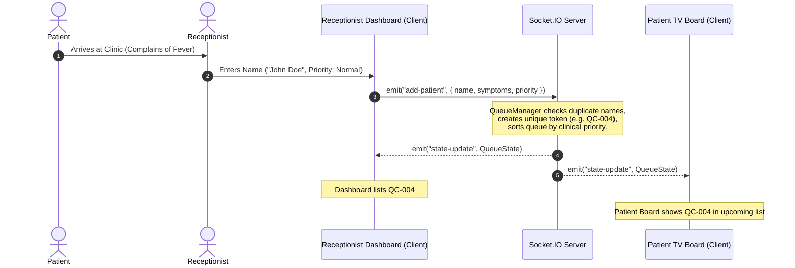
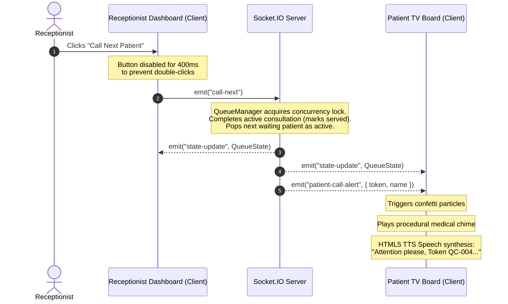
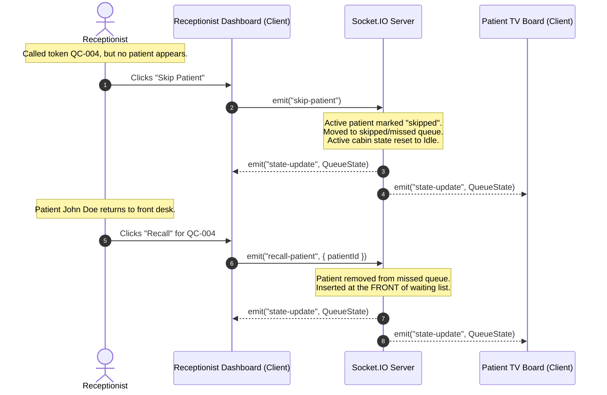
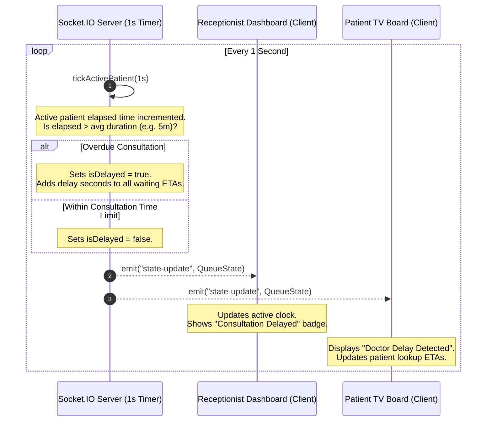

# QueueCure AI - Event Flow Diagram

This document illustrates the real-time event lifecycles and communications between the Receptionist Dashboard, Socket.IO Backend Server, and Patient Waiting Screens.

---

## 1. Patient Registration Flow

---

## 2. Calling next Patient Flow (Text-to-Speech Callout)

---

## 3. Skip & Missed Queue Recall Flow

---

## 4. Periodic Consultation Checking & Delay Detection

